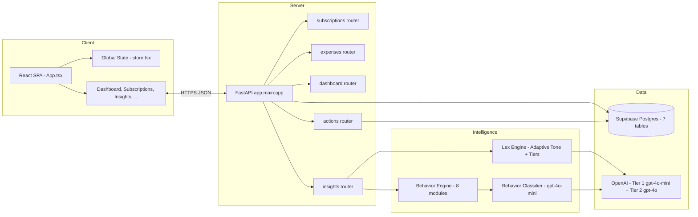
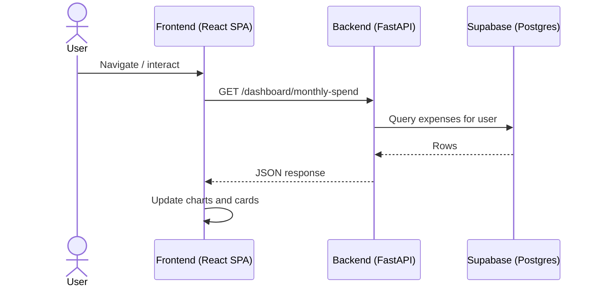
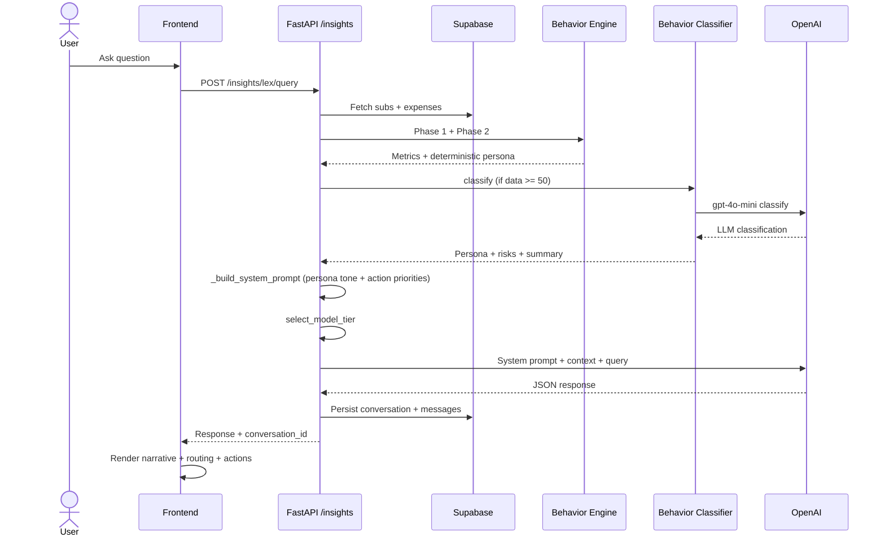
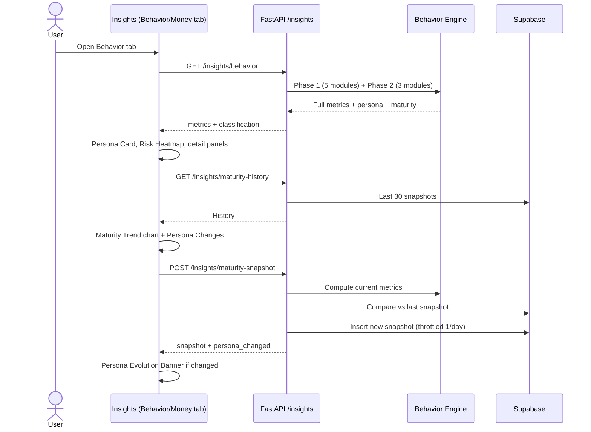

# Spndwisee / FinIQ – Project Snapshot

## 1. High-Level Overview
- **Product**: Personal finance and subscription intelligence app focused on visibility, control, actionable insights, and adaptive behavioral intelligence.
- **Stack**:
  - **Frontend**: React + TypeScript, Vite, Tailwind-style utility CSS, Framer Motion, Recharts (LineChart, ScatterChart, CartesianGrid), lucide-react icons, Supabase client.
  - **Backend**: FastAPI, Supabase Python client, OpenAI API (dual-tier: GPT-4o-mini + GPT-4o) for Lex Intelligence, Pydantic models.
  - **AI Layer**: Behavior Intelligence Engine (8 deterministic modules), Hybrid LLM Classifier (`behavior_classifier.py`), Persona-Driven Adaptive Tone Engine (`lex.py`).
  - **Data**: Supabase Postgres with RLS — tables: `subscriptions`, `expenses`, `category_budgets`, `lex_conversations`, `lex_messages`, `lex_action_log`, `financial_maturity_history`.
- **Key Pillars**:
  - Unified view of linked liquidity and spending.
  - Deep subscription and expense intelligence.
  - Cloud-powered AI assistant (Lex Intelligence via OpenAI) with structured JSON responses, multi-turn conversation memory, and conversation persistence.
  - **Behavior Intelligence Engine** — 8 deterministic modules (5 descriptive + 3 predictive/composite) producing institutional-grade financial analytics.
  - **Behavioral Persona Classification** — Deterministic affinity-scoring classifier (5 personas) + LLM interpretation layer for nuanced profiling.
  - **Persona-Driven Adaptive AI** — Lex dynamically adjusts tone, emphasis, and action priorities based on the user's classified persona.
  - **Financial Maturity Tracking** — Longitudinal maturity score + persona snapshots with evolution detection.
  - Action execution system — Lex-recommended actions (cancel, reduce, switch) applied directly to user data.

## 2. Core Functional Domains

### 2.1 Authentication & Session Management
- **Supabase auth integration** in frontend (see `frontend/App.tsx` and `frontend/src/lib/api.ts`).
- App-level state wraps all screens via `AppProvider` (`frontend/store.tsx`).
- **Flows**:
  - Login / sign-out (`LoginScreen`, `supabase.auth.signOut()` from Dashboard header).
  - Password recovery → `UpdatePasswordScreen` when Supabase auth event `PASSWORD_RECOVERY` fires.
  - Until session is loaded, app shows a **loading state** (spinner view).

### 2.2 Navigation & Screen Architecture
- Single-page app with **bottom navigation bar** in `frontend/App.tsx`.
- Screens mapped to internal `Screen` union:
  - `home` → `Dashboard`
  - `subs` → `Subscriptions`
  - `expenses` → `ExpenseList`
  - `split` → `SplitScreen`
  - `insights` → `Insights`
  - `settings` → `SettingsScreen`
  - `emis` → `EMIScreen`
  - `categoryLogs` → `CategoryLogs`
  - `subDetail` → `SubscriptionDetail` (selected subscription details)
- Animated screen transitions using **Framer Motion** (`AnimatePresence`, `motion.div`).
- Persistent floating bottom nav with icons (Home, SubX, Spend, Split, Stats) + quick access Settings icon.

### 2.3 Subscriptions Management (SubX)
- Backend router: `backend/app/routers/subscriptions.py` (path prefix `/subscriptions`).
- **API Endpoints**:
  - `POST /subscriptions/` – Create subscription, associates `user_id` from current user, inserts into Supabase `subscriptions` table.
  - `GET /subscriptions/` – List subscriptions for authenticated user.
  - `GET /subscriptions/{subscription_id}` – Fetch single subscription, scoped to user.
  - `PUT /subscriptions/{subscription_id}` – Update subscription (partial via `exclude_unset=True`).
  - `DELETE /subscriptions/{subscription_id}` – Delete subscription for user.
- **Subscription model** (see `backend/app/models.py`): includes fields like name, amount, category, billing cycle, status, next renewal date, etc. (exact shape defined there).
- Frontend (`frontend/screens/Subscriptions.tsx`):
  - **SubCard component** — extracted as a standalone component to fix Rules of Hooks violation. Each card renders:
    - Category-specific Lucide icon (Tv, Music, Gamepad2, Cloud, Smartphone, Newspaper, ShoppingBag, Dumbbell, GraduationCap, Shield, Utensils, Car, Globe, etc.).
    - Subscription name, amount, billing cycle, status badge, next renewal date.
  - **Floating Action Button (FAB)** — positioned at `bottom-24` to avoid bottom nav overlap. Opens an "Add Subscription" modal.
  - **Add Subscription Modal** — full-screen overlay with `overflow-y-auto` to handle content that exceeds viewport; includes name, amount, category, billing cycle, next renewal date, and auto-pay toggle.
  - `SubscriptionDetail` screen shows per-subscription details and actions.
  - Subscriptions contribute to **metrics** such as:
    - Monthly subscription spend (normalized annually billed subs to monthly).
    - Active subscriptions count.
    - Per-category spend including recurring commitments.

### 2.4 Expense Tracking
- Backend router: `backend/app/routers/expenses.py` (path prefix `/expenses`).
- **API Endpoints**:
  - `POST /expenses/` – Create expense for current user.
  - `GET /expenses/` – List all expenses for user.
  - `GET /expenses/{expense_id}` – Fetch single expense.
  - `PUT /expenses/{expense_id}` – Update expense.
  - `DELETE /expenses/{expense_id}` – Delete expense.
- Expenses are tied to categories and dates, enabling:
  - Monthly and yearly aggregations.
  - Category-wise analytics.
  - Recent expenses context for Lex.
- Frontend:
  - `ExpenseList` screen shows transaction list, likely filterable by date/category.
  - Expenses are combined with subscriptions for dashboards and insights.

### 2.5 Dashboard & Analytics
- Backend router: `backend/app/routers/dashboard.py` (path prefix `/dashboard`).
- **API Endpoints**:
  - `GET /dashboard/monthly-spend` – Sum of expenses for current month.
  - `GET /dashboard/yearly-spend` – Sum of expenses for current year.
  - `GET /dashboard/active-subscriptions-count` – Count of active subscriptions for user.
  - `GET /dashboard/category-wise-aggregation` – Map of category → total spend.
  - `GET /dashboard/upcoming-renewals` – Subscriptions with `next_renewal_date` within next 7 days.
- Frontend `Dashboard` screen responsibilities (`frontend/screens/Dashboard.tsx`):
  - **Linked Liquidity**:
    - Shows cards for linked bank accounts and wallet balances.
    - Uses secure mode masking (`••••`) vs real amounts (`₹…`).
  - **Goal Tracking**:
    - Savings targets/goals with progress bar, editable target amounts.
    - Animated progress toward target using Framer Motion.
  - **Portfolio Outflow Metrics**:
    - Monthly subscription spend ("Monthly Commitment").
    - Weekly spending and a simple “Health” score.
  - **Category Summary**:
    - Top 5 categories by total spend (expenses + normalized subscription amounts).
  - **Velocity / Projection Visualizations**:
    - Velocity data stub (weekly pseudo-data for charts).
    - Projection chart data for a “Wealth Accelerator” view.
  - **Backend Health Check**:
    - On mount, calls `GET /health` to verify connectivity to FastAPI backend.
  - **Theme & Privacy Controls**:
    - Toggles for dark/light theme.
    - Secure mode toggle to mask currency values.
  - **Account / Session Controls**:
    - Sign-out button calling `supabase.auth.signOut()`.

### 2.6 EMIs, Splits, Category Logs & Settings
- **EMI (Debt) Management**:
  - `EMIScreen` presents EMI-related data; monthly EMI spend is included in Dashboard metrics.
  - Debt is considered in Lex routing bucket `debts` (e.g., Lex response can navigate to EMIs).
- **Split Screen**:
  - `SplitScreen` provides a UI for splitting expenses across people/groups (e.g., roommates, friends).
  - Integrates with existing expense data and categories.
- **Category Logs**:
  - `CategoryLogs` surfaces category-focused history/logs (e.g., recent spikes, trends).
  - Target for Lex routing bucket `logs`.
- **Settings**:
  - `SettingsScreen` centralizes preferences like theme, security mode, maybe account connections.

## 3. Lex Intelligence (AI Engine)

### 3.1 Data Maturity Scoring & Activation Intelligence
- Implemented in `backend/app/lex.py` (Layer 0).
- **LexMode** — three operational modes based on user data maturity:
  - `ACTIVATION` — **No data**: Guided onboarding, zero-API-cost pre-baked responses.
  - `ANALYSIS` — **Moderate data** (25-74 coverage score): Tier 1 model (gpt-4o-mini).
  - `STRATEGIC` — **Rich history** (75+ coverage score): Tier 2 model (gpt-4o) auto-upgrade.
- **`compute_data_coverage(subscriptions, expenses)`**:
  - Produces a **0-100 data coverage score** from four weighted flags (25 pts each):
    - `has_expenses` — at least one expense exists.
    - `has_subscriptions` — at least one active subscription.
    - `has_90_day_history` — expenses span ≥90 days back.
    - `has_category_diversity` — ≥3 distinct expense categories.
  - Returns `{ score, mode, flags }`.
- **Activation Responses** (`ACTIVATION_RESPONSES`):
  - Category-specific pre-baked JSON responses keyed to user intent (subscription, expense, budget, default).
  - Each response includes `text`, `suggestion`, `routing`, and empty `actions`.
  - **Zero API cost** — no OpenAI call when in activation mode.

### 3.2 Financial Context Reduction
- **`reduce_financial_context(user_id, subscriptions, expenses)`** (Layer 1):
  - Computes `monthly_sub_spend` (monthly subs direct-summed, annual subs prorated /12).
  - Calls `compute_data_coverage()` to determine mode.
  - **Computes Behavior Intelligence** (injected into context):
    - Phase 1: `compute_behavior_metrics(subs, expenses)` → 5 descriptive modules.
    - Phase 2: `compute_advanced_behavior_signals(subs, expenses)` → 3 predictive/composite modules.
  - **Hybrid LLM Classification** (when `data_score ≥ 50`):
    - Calls `classify_behavior_profile(combined_metrics)` from `behavior_classifier.py`.
    - Returns persona, confidence, risk areas, strategic focus, behavioral summary, maturity label.
  - Produces context dict with keys:
    - `user_id`, `data_coverage`, `metrics` (total_monthly_subs, active_subs_count).
    - `behavior_metrics` — full Phase 1 output.
    - `advanced_intelligence` — full Phase 2 output (includes `behavioral_persona`, `financial_maturity`).
    - `behavior_profile` — LLM classification result (or `null` if insufficient data).
    - `subscriptions` — active subs list (name, amount, cycle, category).
    - `recent_expenses` — last 5 expenses (name, amount, category).

### 3.3 Model Tier System (`backend/app/openai_client.py`)
- **Dual-tier model architecture**:
  - **Tier 1 (fast + cheap)**: `gpt-4o-mini` — temperature 0.4, max_tokens 1024. Default for all queries.
  - **Tier 2 (high-value)**: `gpt-4o` — temperature 0.3, max_tokens 2048. Reserved for deep analysis.
- **Heuristic Model Router** — `select_model_tier(query, history_len)`:
  - Upgrades to Tier 2 when query contains strategy keywords (`strategy`, `long-term`, `plan`, `optimise`, `projection`, `forecast`, `retire`, `invest`, `deep analysis`, `annual review`, `full audit`, `comprehensive`) or conversation exceeds 10 turns.
- **`generate_lex_response(system_prompt, user_prompt, conversation_history?, model?)`**:
  - Builds `[system, ...history, user]` message array.
  - Forces `response_format: { type: "json_object" }`.
  - Attaches `_meta` to response: `{ model, prompt_tokens, completion_tokens, total_tokens }`.
  - Graceful fallback on JSON parse failure.

### 3.4 Adaptive Tone Engine (Persona-Driven System Prompt)
- **Phase 3 — `_build_system_prompt(context)`**:
  - Replaces the static `LEX_SYSTEM_PROMPT` with a **dynamically constructed prompt** adapting to the user's behavioral persona.
  - **Persona resolution priority**: LLM-classified > deterministic > keyword fallback > generic.
  - **Base prompt** (always present): Lex role, capabilities, Phase 1+2 metric descriptions, JSON output schema, routing rules.
  - **`PERSONA_TONE_DIRECTIVES`** — 5 persona-specific tone blocks:
    - **The Impulsive**: Corrective but supportive. References volatility/weekend numbers. Prioritises budget controls.
    - **The Drifter**: Analytical, trend-focused. References 90-day drift percentages. Pushes category reductions.
    - **The Subscribed**: Direct about recurring waste. Leads with burden ratio. Pushes Action tab aggressively.
    - **The Optimizer**: Peer-level. Focuses on capital allocation and surplus utilisation. Suggests investing.
    - **The Stable Builder**: Encouraging, forward-looking. Focuses on scaling savings and incremental improvement.
  - **`PERSONA_ACTION_PRIORITIES`** — 5 persona-specific action ordering blocks appended after tone:
    - Each defines a numbered priority list of action types tailored to the persona.
    - e.g., The Subscribed: `cancel_subscription` > `switch_plan` > `reduce_budget` > consolidate overlaps.
    - e.g., The Optimizer: invest surplus > optimise billing > automate savings > marginal budget gains.

### 3.5 Lex Query Processing
- **`process_lex_query(query, context, conversation_history?, model_override?)`**:
  - Determines `lex_mode` from data coverage.
  - **Activation mode**: Returns pre-baked response (zero API cost).
  - **Analysis / Strategic mode**:
    - Builds dynamic system prompt via `_build_system_prompt(context)`.
    - Builds user prompt via `_build_user_prompt()` — injects financial context as JSON code-block.
    - Calls `select_model_tier(query, len(history))` for automatic model routing.
    - **Strategic auto-upgrade**: If `lex_mode == STRATEGIC` and no override, forces `gpt-4o`.
    - Ensures all required keys (`text`, `suggestion`, `routing`, `actions`) have defaults.
  - **Routing rules**: Subscriptions > `commitment`, Expenses > `spending`, Patterns > `behavior`, Debts > `debts`, Optimisations > `action`, General > `money`.
  - **JSON response schema**: `{ text, suggestion, routing: { target_tab, should_navigate }, actions[], conversation_id, _meta: { model, prompt_tokens, completion_tokens, total_tokens } }`.

### 3.6 Conversation Persistence
- **Database tables** (`backend/sql/schema.sql`):
  - **`lex_conversations`**: UUID PK, user_id, title (auto from first query, 60 chars), model, timestamps.
  - **`lex_messages`**: BIGINT PK, conversation_id FK, role (user|assistant|system), content, model, tokens_used.
  - **`lex_action_log`**: BIGINT PK, user_id, conversation_id FK, action_type, label, metadata (JSONB), status, detail.
- **Persistence flow** (in `POST /insights/lex/query`):
  1. Auto-create conversation if no `conversation_id` provided.
  2. After OpenAI response, persist both user message and assistant response to `lex_messages`.
  3. Touch `updated_at` on parent conversation.
  4. Return `conversation_id` in response for frontend session tracking.
- All tables have **RLS** — users can only access their own data.

### 3.7 Insights API Integration
- Backend router: `backend/app/routers/insights.py` (prefix `/insights`).
- **Endpoints**:
  - `GET /insights/` – Placeholder (reserved for future non-Lex insights).
  - `GET /insights/behavior` – Phase 1 + Phase 2 behavior metrics + hybrid LLM classification:
    - Checks classification cache in `lex_conversations` table.
    - Re-classifies via `classify_behavior_profile()` when stale (>30 days via `should_reclassify()`).
    - Returns `{ status, metrics, classification }`.
  - `POST /insights/lex/query` – Full Lex pipeline: fetch data > reduce context > process query (threadpool) > persist messages > return response with `conversation_id`.
  - `GET /insights/maturity-history` – Up to 30 historical maturity snapshots.
  - `POST /insights/maturity-snapshot` – Compute + persist snapshot with evolution detection (see section 6).

### 3.8 Frontend Lex Experiences

#### 3.8.1 Dashboard Lex Widget
- Location: `frontend/screens/Dashboard.tsx`.
- User types question > `handleLexQuery` posts to `/insights/lex/query` > displays narrative + routing suggestion pill.
- Maps `target_tab` to app screens: `money`>`home`, `commitment`>`subs`, `behavior`>`insights`, `spending`>`expenses`, `debts`>`emis`, `logs`>`categoryLogs`.

#### 3.8.2 Insights Lex Panel
- Location: `frontend/screens/Insights.tsx` (bottom section).
- Input "Tell me a story about my money..." > calls Lex > if routing matches bucket, updates `activeBucket` instead of navigating.

---

## 4. Behavior Intelligence Engine (`backend/app/behavior_engine.py`)

### 4.1 Overview
A fully deterministic analytics engine (786 lines) that computes structured behavioral metrics from raw expense + subscription data. These signals are:
1. **Injected into the Lex system prompt** so OpenAI reasons over proprietary intelligence, not raw transactions.
2. **Surfaced directly in the frontend** Insights UI (Behavior + Money tabs).
3. **Fed to the LLM classifier** (`behavior_classifier.py`) for nuanced interpretation.

### 4.2 Phase 1 — Descriptive Analytics (5 modules)

#### 4.2.1 Spend Volatility Index (`_spend_volatility`)
- Standard deviation of monthly spend over the last 6 months, normalized to **0-100 score**.
- Classification: `High` (>=60), `Medium` (>=30), `Low` (<30).
- Trend: `increasing` / `decreasing` / `stable` (compares last 2 months, +/-10% threshold).
- Output: `{ volatility_score, classification, trend, monthly_totals }`.

#### 4.2.2 Category Concentration Index (`_category_concentration`)
- **Herfindahl-Hirschman Index (HHI)**: sum of (category_share)^2 — measures diversity.
- High score = concentrated spending in few categories (lifestyle overexposure risk).
- Output: `{ concentration_score (0-1), dominant_category, category_shares }`.

#### 4.2.3 Subscription Burden Ratio (`_subscription_burden`)
- `monthly_subscription_spend / total_monthly_spend` (subs + expenses for current month).
- Risk levels: `Critical` (>0.5), `Elevated` (>0.35), `Healthy` (<=0.35).
- Output: `{ burden_ratio (0-1), risk_level, monthly_sub_spend, total_monthly }`.

#### 4.2.4 Recurring Creep Indicator (`_recurring_creep`)
- Detects subscriptions added in the last **60 days**.
- Computes delta monthly commitment from new services.
- Output: `{ new_subscriptions_60d, delta_monthly_commitment, new_services[] }`.

#### 4.2.5 Weekend Spend Bias (`_weekend_bias`)
- `weekend_spend / total_spend` ratio (Saturday + Sunday).
- Patterns: `Leisure-skewed` (>0.4), `Balanced` (0.28-0.4), `Weekday-heavy` (<0.28).
- Output: `{ weekend_ratio (0-1), pattern, weekend_spend, weekday_spend }`.

### 4.3 Phase 2 — Predictive + Composite Intelligence (3 modules)

#### 4.3.1 Subscription Risk Scoring (`_subscription_risk_scores`)
- Scores **each active subscription 0-100** on waste risk.
- Drivers per subscription: usage patterns, cost relative to category, overlap detection.
- Output: `[{ name, risk_score, risk_level, drivers[] }]` per subscription.

#### 4.3.2 Lifestyle Drift Detection (`_lifestyle_drift`)
- **90-day temporal comparison**: current 90-day category spend vs prior 90-day baseline.
- Flags categories with >20% change.
- Output: `{ drift_detected, drift_count, categories[{ category, change_pct }] }`.

#### 4.3.3 Financial Maturity Index (`_financial_maturity_index`)
- **Flagship composite 0-100 score** built from Phase 1 outputs:
  - Components: savings_capacity, debt_management, spending_stability, diversification, debt_load.
  - Each component is independently scored and weighted.
- Classification: `At Risk` (<30), `Foundation` (30-49), `Developing` (50-69), `Advanced` (>=70).
- Output: `{ maturity_index, classification, components{}, strengths[], weaknesses[] }`.

### 4.4 Deterministic Persona Classifier (`_classify_behavioral_persona`)
- **5 behavioral personas** with structured definitions:
  1. **The Optimizer** — Disciplined, low volatility, minimal subscription burden, intentional spending.
  2. **The Drifter** — Shifting patterns, lifestyle inflation creeping in through discretionary categories.
  3. **The Subscribed** — Recurring commitments dominate; disproportionately high subscription spend.
  4. **The Impulsive** — Weekend spikes, high volatility, uneven spending rhythm.
  5. **The Stable Builder** — Balanced profile, moderate diversification, controlled debt.
- **Affinity scoring algorithm**:
  - Each persona accumulates affinity points from Phase 1 signals (volatility, burden, HHI, drift, weekend).
  - Uses thresholds: e.g., `vol_score < 30 -> Optimizer +3.0`, `burden_ratio > 0.5 -> Subscribed +4.5`.
  - Winner = persona with highest affinity. Confidence = `winner_score / total_score`.
  - Falls back to "The Stable Builder" @ 0.20 confidence if no clear winner.
- **Risk area determination** — ranks by severity: Spend Volatility, Subscription Burden, Lifestyle Drift, Weekend Impulse, Category Overexposure.
- Output: `{ persona, confidence, description, traits[], primary_risk_area, secondary_risk_area, affinity_scores{} }`.

### 4.5 Composite Exports
- `compute_behavior_metrics(subs, expenses)` -> Phase 1 (5-module dict).
- `compute_advanced_behavior_signals(subs, expenses)` -> Phase 2 (subscription_risk_scores, lifestyle_drift, financial_maturity, behavioral_persona).
- `compute_full_intelligence(subs, expenses)` -> Phase 1 + Phase 2 merged.

---

## 5. Hybrid LLM Classification (`backend/app/behavior_classifier.py`)

### 5.1 Purpose
LLM interpretation layer that accepts **deterministic metrics** from the Behavior Engine and uses `gpt-4o-mini` to produce nuanced, qualitative classification. The LLM **never computes numbers** — it only interprets structured outputs.

### 5.2 `classify_behavior_profile(metrics)`
- Flattens combined Phase 1+2 metrics into a concise input payload (`_prepare_classifier_input`):
  - Volatility score + classification + trend.
  - Subscription burden ratio + risk level.
  - Category concentration HHI + dominant category.
  - New subscriptions count, weekend ratio + pattern.
  - Lifestyle drift detected + top 3 drifting categories.
  - Financial maturity index + classification + strengths/weaknesses.
  - Rule-based persona + confidence.
- Calls gpt-4o-mini with `CLASSIFIER_SYSTEM_PROMPT` (temperature 0.3, forced JSON, max 512 tokens).
- **Response schema**: `{ persona, confidence, primary_risk_area, secondary_risk_area, strategic_focus, behavioral_summary, maturity_label, maturity_tone }`.
- Attaches `_meta` with model, token usage, and `classified_at` timestamp.
- On failure: falls back to `_fallback_classification()` — returns deterministic persona data with neutral tone.

### 5.3 Cache & Re-classification (`should_reclassify`)
- Cached in `lex_conversations` table fields: `behavior_persona`, `maturity_label`, `last_behavior_analysis`.
- Re-classification triggered when:
  - No prior classification exists.
  - Data coverage score >= 50 (sufficient data).
  - Last analysis is older than `max_age_days` (default 30).
- Avoids wasting API calls on sparse data (score < 50 -> skip).

---

## 6. Financial Maturity History & Persona Evolution

### 6.1 Database Table (`financial_maturity_history`)
- **Schema** (in `backend/sql/schema.sql`):
  - `id` (BIGINT PK), `user_id` (FK -> auth.users).
  - `maturity_score` (INT 0-100), `classification` (text).
  - `persona` (text), `persona_confidence` (FLOAT).
  - `components` (JSONB — component scores snapshot).
  - `behavior_snapshot` (JSONB — volatility_score, burden_ratio, concentration_hhi, weekend_ratio, drift_count).
  - `previous_persona` (text), `persona_changed` (BOOLEAN).
  - `snapshot_at` (TIMESTAMPTZ, default NOW()).
- RLS enabled: users own their maturity history.

### 6.2 Snapshot Endpoint (`POST /insights/maturity-snapshot`)
- **Compute flow**:
  1. Fetch user's subs + expenses > run Phase 1 + Phase 2 metrics.
  2. Extract maturity_index, classification, persona, persona_confidence, component scores.
  3. Build lean behavior_snapshot (volatility, burden, concentration, weekend, drift).
  4. Fetch last snapshot for same user.
- **Persona evolution detection**:
  - Compares `current.persona` vs `last_snapshot.persona`.
  - Sets `persona_changed = true` if they differ.
  - Stores `previous_persona` for timeline visualization.
- **Throttling**: Max 1 snapshot per 23 hours per user.
- **Returns**: `{ status, snapshot, persona_changed, previous_persona, evolution_summary, skipped? }`.

### 6.3 History Endpoint (`GET /insights/maturity-history`)
- Returns up to **30 most recent snapshots** ordered by `snapshot_at DESC`.
- Powers the Maturity Trend charts in the frontend.

---

## 7. Action Execution System (`backend/app/routers/actions.py`)

### 7.1 Endpoint: `POST /actions/execute`
- **Request payload**: `{ "actions": [{ "type": "...", "label": "...", "metadata": {...} }] }`.
- **Supported action types**:
  - `cancel_subscription` — Updates subscription `status` -> `cancelled` (scoped to user).
  - `reduce_budget` — Upserts `category_budgets` table with new `monthly_limit`.
  - `switch_plan` — Updates subscription `billing_cycle` (e.g., monthly -> yearly).
- **Result format**: Per-action `{ label, status, detail/reason }` where status = `success | failed | skipped | error`.
- **Response**: `{ summary: "X action(s) executed, Y failed/skipped.", results: [...] }`.

---

## 8. Frontend Insights UI (`frontend/screens/Insights.tsx`)

### 8.1 Four Intelligence Buckets
- Selectable via styled tab bar: `money`, `commitment`, `behavior`, `action`.

### 8.2 Money Tab
- **Money Intelligence** header with aggregate subscription amount.
- **Financial Maturity Index** — Hero card: radial score display (0-100), classification label, component breakdown, strengths + weaknesses.
- **Supporting Signals Grid** — 2x3 cards: Subscription Burden, Category Concentration, Weekend Bias, Recurring Creep, Spend Volatility, Lifestyle Drift.
- **Maturity Trend Mini-Chart** — Recharts `LineChart` showing maturity score over time.
- **Subscription Burden Bar** — visual burden percentage + risk level.

### 8.3 Commitment Tab
- Monthly commitment total, upcoming outflow warnings, risk surfaces.

### 8.4 Behavior Tab
- **Behavioral Persona Card** — gradient border card with persona name, confidence, description, traits, risk areas, strategic focus, behavioral summary. Source badge: "Hybrid AI" or "Rule-based".
- **Persona Evolution Banner** — gradient card when persona shifts: shows `previous -> current` with evolution summary. Framer Motion animated.
- **Risk Heatmap** — 5-cell color-coded grid: Volatility, Burden, Concentration, Weekend, Drift. Colors: green (low) > yellow (moderate) > red (high).
- **Maturity Trend Chart** — Full Recharts `LineChart` with X: snapshot dates, Y: maturity score (0-100), tooltips, responsive.
- **Persona Changes Timeline** — Historical persona evolution events from maturity history.
- **Six Expandable Detail Panels** (Framer Motion accordion):
  1. Spend Volatility — score, classification, trend, monthly breakdown.
  2. Category Concentration — HHI, dominant category, shares.
  3. Subscription Burden — ratio, risk, amounts.
  4. Recurring Creep — new services, delta commitment.
  5. Weekend Bias — ratio, pattern, weekend vs weekday.
  6. Service Value Map — Recharts `ScatterChart` (cost vs utility).

### 8.5 Action Tab
- Lex-recommended actions with **checkbox selection**.
- "Execute Selected" button > `POST /actions/execute`.
- Per-action results with success/failure indicators.

---

## 9. System & Cross-Cutting Concerns

### 9.1 Backend Application Setup
- FastAPI app in `backend/app/main.py`:
  - CORS for `http://localhost:3000` and `5173`.
  - Logging middleware (URL, method, duration, status).
  - Routers: `/subscriptions`, `/expenses`, `/dashboard`, `/insights`, `/actions`.
  - Utility: `GET /` (welcome), `GET /health` (health check).

### 9.2 Data & Persistence
- Supabase client in `backend/app/dependencies.py`: `get_db`, `get_current_user`.
- Pydantic models in `backend/app/models.py` (synced with `frontend/types.ts`).
- **SQL schema** (`backend/sql/schema.sql`) — 7 tables:
  1. `subscriptions` — name, category, amount, billing_cycle, next_renewal_date, auto_pay, status.
  2. `expenses` — name, amount, category, date, payment_method.
  3. `category_budgets` — user_id + category (unique), monthly_limit.
  4. `lex_conversations` — conversation sessions with model, title, timestamps.
  5. `lex_messages` — per-message role, content, model, tokens_used.
  6. `lex_action_log` — action audit trail (type, label, JSONB metadata, status).
  7. `financial_maturity_history` — longitudinal maturity scores, personas, evolution tracking.
- All tables have **RLS** and appropriate indexes.

### 9.3 AI Provider & Privacy
- **OpenAI** with two tiers: GPT-4o-mini (Tier 1, everyday) + GPT-4o (Tier 2, deep analysis).
- **Behavior Engine** is fully deterministic — zero API cost.
- **Behavior Classifier** uses gpt-4o-mini for interpretation only (cached 30 days).
- No raw account numbers or credentials sent to OpenAI — only aggregated metrics + names/amounts.
- `OPENAI_API_KEY` in `backend/.env`, never committed.
- Frontend secure mode masks sensitive amounts.

### 9.4 Testing & Tooling
- Backend tests:
  - `backend/test_backend.py`, `backend/test_lex_logic.py`, `backend/test_local_ai.py`, `backend/app/test_main.py`.
  - `backend/test_phase3.py` — Phase 3 integration tests (snapshot, history, evolution, tone engine, fallback).
- Frontend tests:
  - Playwright in `frontend/tests/screenshots.spec.ts`.
- Dev experience:
  - Frontend: `npm run dev` (Vite, port 3000).
  - Backend: `uvicorn app.main:app --reload` from `backend/` (Python 3.11.9 venv at `.venv`).

---

## 10. User Journeys (End-to-End)

1. **New User Setup (Activation Mode)**
   - Authenticate via Supabase. Lex enters **Activation mode** (zero API cost).
   - Asks Lex > gets guided onboarding directing to SubX or Spend.

2. **Track Subscriptions & Expenses**
   - Add subs via FAB > modal. Log expenses in Spend tab.
   - Dashboard aggregates commitments, weekly spend, health.

3. **Ask Lex for Strategic Advice**
   - Type question in Dashboard or Insights.
   - Lex responds with **persona-adapted tone** (e.g., warning The Impulsive about weekend spending).
   - Narrative + routing suggestion + concrete actions. Conversation auto-persisted.

4. **Explore Behavior Intelligence**
   - Insights > Behavior tab: Persona card, Risk Heatmap, expandable panels, Service Value Map.

5. **Track Financial Maturity Over Time**
   - Insights > Money tab: Maturity Index hero card, Supporting Signals, Maturity Trend chart.
   - Persona evolution detected > Persona Evolution Banner appears.

6. **Execute Lex-Recommended Actions**
   - Action tab: select actions via checkboxes > execute > see per-action results.

7. **Debt & EMIs**
   - EMIs aggregated into monthly outflow. Lex routes to EMIs when discussing debt.

---

## 11. Architecture

### 11.1 Component Overview

### 11.2 Standard Request Flow (Non-Lex)

### 11.3 Lex Intelligence Flow (Persona-Adaptive)

### 11.4 Behavior Intelligence + Maturity Flow

---

*This snapshot is a living high-level map of the system. Last updated after Phase 3: Persona-Driven System Behavior (Adaptive Tone Engine, Action Weighting, Maturity History, Evolution Detection, Risk Heatmap, Trend Visualization).*
